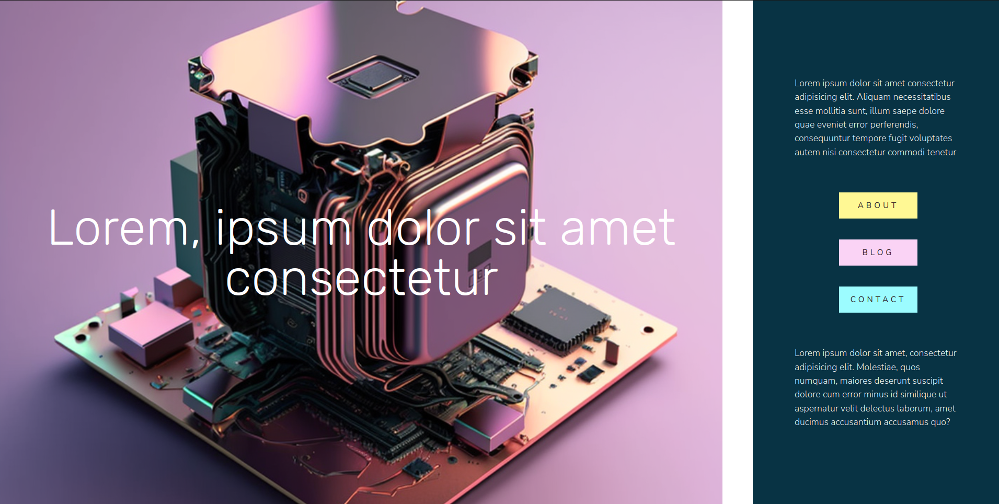

# Fun colorful web - React 💛

  

                                          
# Important!

The first part of the code refers to a React implementation that is part of a larger project. The associated CSS layout is located in the "Fun-colorful-web-design-pt2" file.
<I>Separating the styles into a separate file promotes better code organization and maintainability.</i>

                                                         INTRODUCTION

This code represents a framework that leverages HTML and CSS to create a web application. It uses React, a JavaScript library for building user interfaces, to provide a dynamic and interactive experience. The framework allows you to easily create a visually appealing and interactive About section for your web application.

The About section includes a set of buttons that are interactive and exhibit an effect when the mouse is hovered over them.
You can customize the button styles and define the desired actions to be performed when the buttons are interacted with.

                                                            USAGE
                                                            
1. Import the necessary dependencies. In this case, React and the image file (Cpu_Background.png) are imported.

2. Define the About component function.

3. Inside the About component, return the JSX code that represents the About section.

4. The section is divided into two main divisions using flexbox. The first division (72% width) displays a background image and a heading using dynamic inline styles.

5. The second division (25% width) has a cyan-colored background and contains text paragraphs, a set of buttons, and additional text.

6. Customize the content within the JSX code to fit your specific requirements.

7. Export the About component as the default export.

 

                                                        Editing example

